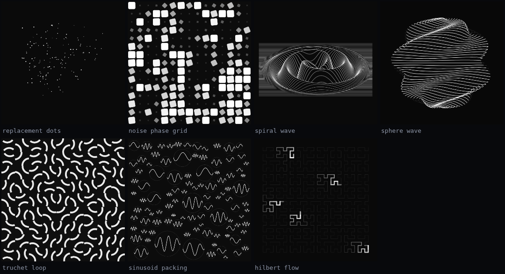

# LoopLab

A single-file playground for **seamless animation loops** — code editor on the
left, live looping preview on the right. Inspired by the animations of
[Etienne Jacob (bleuje)](https://bleuje.com/animationsite/).

Open `index.html` in a browser. No build step, no dependencies, no network.



## What's in it

- **Editor pane** — syntax highlighting, line numbers, auto-run on idle,
  `Ctrl/Cmd + Enter` to run, `Ctrl/Cmd + S` to download the sketch.
- **Preview pane** — motion blur, playback speed, frame scrubber, PNG export,
  and one-loop `.webm` recording.
- **Seven example sketches**, each demonstrating one technique and written to
  be taken apart.

Your edits are kept in `localStorage`; **Reset** restores the original sketch.

## Writing a sketch

A sketch is plain JavaScript. There is one global clock, `t`, which runs from
0 to 1 over exactly one loop:

```js
const W = 540, H = 540;
const numFrames = 120;
const samplesPerFrame = 4;   // motion blur sub-frames

function setup(){          // once, when the sketch compiles
  randomSeed(7);
}

function draw_(){          // once per sub-frame
  background(8);
  const r = 120 + 40 * sin(TWO_PI * t);
  noFill(); stroke(255);
  circle(W/2, H/2, r);
}
```

Anything computed from `t` and nothing else will loop. Never accumulate state
between frames: `draw_()` runs several times per displayed frame, and out of
order while you scrub.

The drawing API is Processing-flavoured (`background`, `fill`, `stroke`,
`push`/`pop`, `translate`, `rotate`, `beginShape`/`vertex`/`endShape`, `map`,
`lerp`, `noise`, …). The loop-specific helpers are:

| | |
|---|---|
| `ease(p, g)` | power easing; `g=1` linear, `g=3` snappy, `g=5` nearly a step |
| `mod1(x)` | wrap into `[0,1)` — how phase offsets stay seamless |
| `pingpong(p)` | 0 → 1 → 0 over one period |
| `loopNoise(x, y, t, r)` | 2D noise that walks a circle in time, so it repeats exactly |
| `noise(x,y,z,w)` | 4D Perlin, `0..1` (`snoise` for `-1..1`) |
| `c` | `0..1` from the mouse's vertical position — a free tweaking knob |

Full reference is behind the **API & credits** button in the app.

## The three tricks worth knowing

**Offsets only matter modulo 1.** Give every element the same 1-periodic
animation and a different phase offset, and the whole field loops no matter
where the offsets came from — noise, distance, index, anything.

**Replacement.** A single object travelling a long path can't loop. K objects
spaced at `p = (i + t) / K` can: after one loop each has slid into its
neighbour's slot, so the picture repeats even though nothing returned home.

**Integer counts.** A wave phase like `RINGS*r + ARMS*angle - t` loops cleanly
only when `RINGS` and `ARMS` are whole numbers. Same for rotational symmetry:
check what turn actually maps a shape back onto *itself* before you animate it.
A Truchet tile looks like it has a quarter-turn symmetry and doesn't — that one
costs a visible seam.

## Credits and licensing

The techniques come from Etienne Jacob's public
[tutorials](https://bleuje.com/tutorials/), and the motion blur approach is
[Dave / beesandbombs'](https://bleuje.com/tutorial6/) template.

Etienne Jacob's own Processing sources are at
[github.com/Bleuje/processing-animations-code](https://github.com/Bleuje/processing-animations-code)
and are **copyright, all rights reserved** — so none of that code is reproduced
here. Everything in this playground was written from scratch. Read his code at
the source; play with it here.
