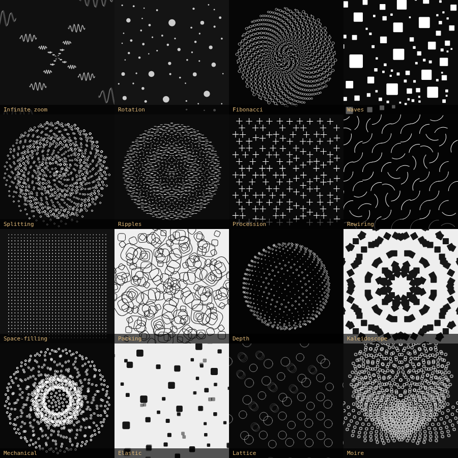

# Loop Breeder

Interactive evolution for seamless animation loops. You are the fitness function:
keep what you like, discard the rest, let the survivors have children. Every
animation ever made stays in a lineage tree, so an abandoned branch is always
one click away.

Open `index.html`. No build, no dependencies, no network.

Companion to [`../bleuje-playground`](../bleuje-playground) (LoopLab) — anything
bred here can be copied straight into that editor as a normal sketch.

## The loop you're in

| | |
|---|---|
| **New population** | twelve fresh draws from the genome space |
| click a tile | keep it — a gold border means it survives the next breed |
| **✕** | discard it now rather than waiting |
| **Breed** | kept tiles carry over unchanged; the empty slots fill with their children |
| **⤢** | open it full size: genes, source, per-gene rerolls |
| **Lineage** | the whole tree, pruned branches greyed out — click any node to go back |

Populations converge fast, so one child in five is a *bold* mutant at roughly
double the mutation rate. Without it you get twelve near-identical tiles by the
third generation and nothing left to choose between.

## Themes

Sixteen high-level ideas, lifted from the source set, as checkboxes above the
population. A theme is **not** a gene — it's a *bias across several genes at
once*, applied to fresh populations, to every child in a breed, and to
single-gene rerolls.

| theme | what it pins |
|---|---|
| Infinite zoom | `nest` layout + `zoom` motion — one loop is one doubling |
| Rotation | spin / orbit, ramp or sine shaping |
| Fibonacci | phyllotaxis disc or sphere, spiral/index offset |
| Waves | travelling displacement, radial or diagonal propagation |
| Splitting | the `split` motion — each element divides and rejoins |
| Ripples | radial offset field, sine or dwell shaping |
| Procession | replacement technique along a path |
| Rewiring | Truchet tiles: grid + arcs + spin + ramp, all four together |
| Space-filling | Hilbert curve |
| Packing | circles of many sizes |
| Depth | a shaded 3D body |
| Kaleidoscope | mirror or 2/3/4/6-fold symmetry |
| Mechanical | dwell — sits hard at both ends of the loop |
| Elastic | overshoot and settle |
| Lattice | flat tiling, no centre |
| Moiré | dense fields that interfere |

Ticking two blends them rather than making them fight, because each constrains
only the axes it names: **Kaleidoscope** touches symmetry alone and leaves
everything else free, while **Rewiring** pins layout, render, motion *and* shape
together because Truchet tiles only work as a set. All 120 pairs are tested.

**Themes win over repair.** Where a theme collides with something structural — a
convoy needs a path to march along, Truchet arcs need a square cell — the pinned
gene stays and the unpinned one gives way. Without that rule, repair silently
undid the checkbox and a tick stopped meaning anything by the third generation.
Measured stickiness is 100% for fifteen of the sixteen; `Depth` is 91%, because
"sphere" and "convoy" are a genuine structural conflict that something has to
lose.

## The genome

Six independent genes. They're orthogonal on purpose: each one closes its own
loop, so **any** combination of them also loops. That's what makes random draws
usable rather than noise.

| gene | what it decides |
|---|---|
| `layout` | where elements live — grid, brick, rings, disc, sphere, Hilbert curve, packing, walk |
| `offset` | the phase-delay field — radial, angular, noise, index, diagonal, spiral |
| `shape` | the 1-periodic function each element runs — sine, ping-pong, dwell, ramp |
| `motion` | what that function does — pulse, spin, orbit, jump, wave, breathe, split, zoom, convoy |
| `render` | how one element is drawn — dot, square, ring, arcs, bar, cross, wavelet, polyline |
| `symmetry` | mirror, or 2/3/4/6-fold rotation over the whole field |
| `look` | palette, stroke weight, motion blur, loop length |

A genome compiles to readable JavaScript, and **that source is the single source
of truth** — what you see animating is exactly what "copy code" gives you.

### Genes that can't be combined

Most pairs work. A few are structurally impossible and get repaired rather than
discarded — each of these was a bug found by testing, not a guess:

- A **convoy** needs consecutive elements to be *spatially adjacent*, not merely
  ordered. A phyllotaxis disc and a Fibonacci sphere are ordered but not paths;
  markers teleport along them and the result reads as static noise.
- **`ramp`** runs 0 → 1 and never returns, so it only closes the loop when it
  drives a rotation through a symmetry of the shape being drawn. Anywhere else
  it leaves a hard cut at t=1.
- ...and that rotation has to land on a symmetry the render *actually has*. A
  Truchet arc pair looks like it has a quarter-turn symmetry; it doesn't. Its
  true period is a half turn.
- A **polyline** only shows motion that moves its vertices, so `pulse` and
  `spin` would leave it frozen.
- **Infinite zoom** substitutes level *k* for level *k−1* every loop, so an
  element's appearance may depend only on where it sits in the octave stack,
  never on which element it is. Two consequences: the per-level angular drift
  must be a whole number of angular slots, and the phase-offset field has to be
  flat — any per-element offset shows up through renders that embed the phase
  (`wavelet` caught this) and cuts the loop open.

## Deterministic, until it needs not to be

The evolution here is ordinary code. Mutation is a seeded perturbation of a
parameter vector; crossover picks each gene from one parent or the other. It runs
instantly, offline, and the same seed always yields the same animation. **No
model is involved and none is needed.**

What that can't do is *invent a gene*. Parametric evolution only recombines the
vocabulary it was given, so a lineage saturates — you start seeing the same seven
motions rearranged. That's where a model earns its place, and only there.

So the architecture is two tiers:

- **Tier 1 — deterministic search inside the vocabulary.** Instant, free,
  reproducible, dozens of candidates per second. This is the inner loop and it's
  where you'll spend nearly all your time.
- **Tier 2 — a model to widen the vocabulary.** Open any animation, hit **Copy
  prompt**, and you get the real source plus the loop-closure rules. Paste
  whatever comes back into the box below it; it's compiled and test-rendered
  before being accepted, then joins the lineage as a child you can keep breeding
  from.

Tier 2 is much slower and much rarer than tier 1, which is the right ratio. The
seam is deliberately manual — no API key, no server, nothing to configure.

## Credits and licensing

The technique vocabulary is drawn from the animations and public
[tutorials](https://bleuje.com/tutorials/) of Etienne Jacob, and the motion blur
is Dave / beesandbombs' template.

Etienne Jacob's own Processing sources are at
[github.com/Bleuje/processing-animations-code](https://github.com/Bleuje/processing-animations-code)
and are **copyright, all rights reserved** — none of that code is reproduced
here. Everything in this repository was written from scratch.
